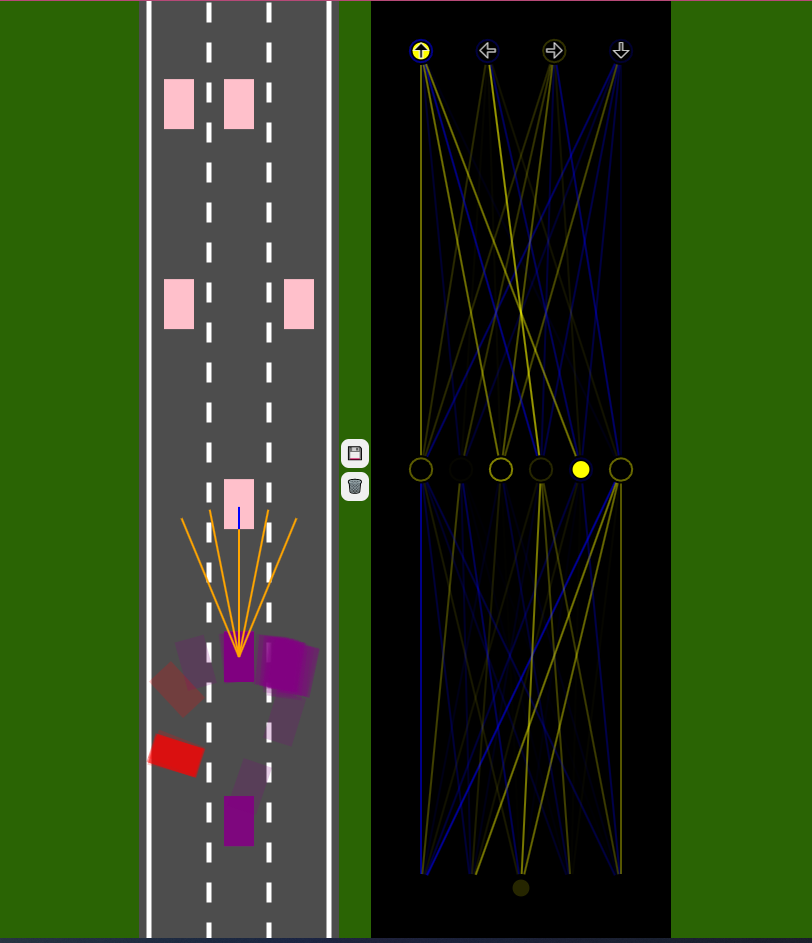

# Self-Driving Car - Neural Networks and Machine Learning

## Table of contents

- [Overview](#overview)
  - [Screenshot](#screenshot)
  - [Links](#links)
- [My process](#my-process)
  - [Built with](#built-with)
  - [What I learned](#what-i-learned)
  - [Continued development](#continued-development)
  - [Useful resources](#useful-resources)
- [Author](#author)
- [Acknowledgments](#acknowledgments)

## Overview

### Screenshot



### Links

- Tutorial URL: [YouTube Link](https://www.youtube.com/watch?v=Rs_rAxEsAvI&t=51s)

### Built with

- JavaScript
- HTML
- Canvas

### What I learned

I learned how to implement the car driving mechanics, define the environment, simulate sensors, detect collisions, and how to make the car control itself using neural network.

```html
<h1>Some JavaScript code I'm proud of</h1>
```

```js
#getReading(ray, roadBorders, traffic){
        let touches = [];

        for(let i=0; i <roadBorders.length; i++){
            const touch = getIntersection(
                ray[0],
                ray[1],
                roadBorders[i][0],
                roadBorders[i][1]
            );
```

I learned about private class features within JavaScript. Private methods are dictated by using a # prefix. Private class features can not be accessed outside of the function they are used in.

### Continued development

I want to continue with focusing on other aspects of JavaScript.

## Author

- LinkedIn - [@avion-cobb](https://www.linkedin.com/in/avion-cobb/)
- Twitter - [@Avion_Cobb](https://twitter.com/Avion_Cobb)
